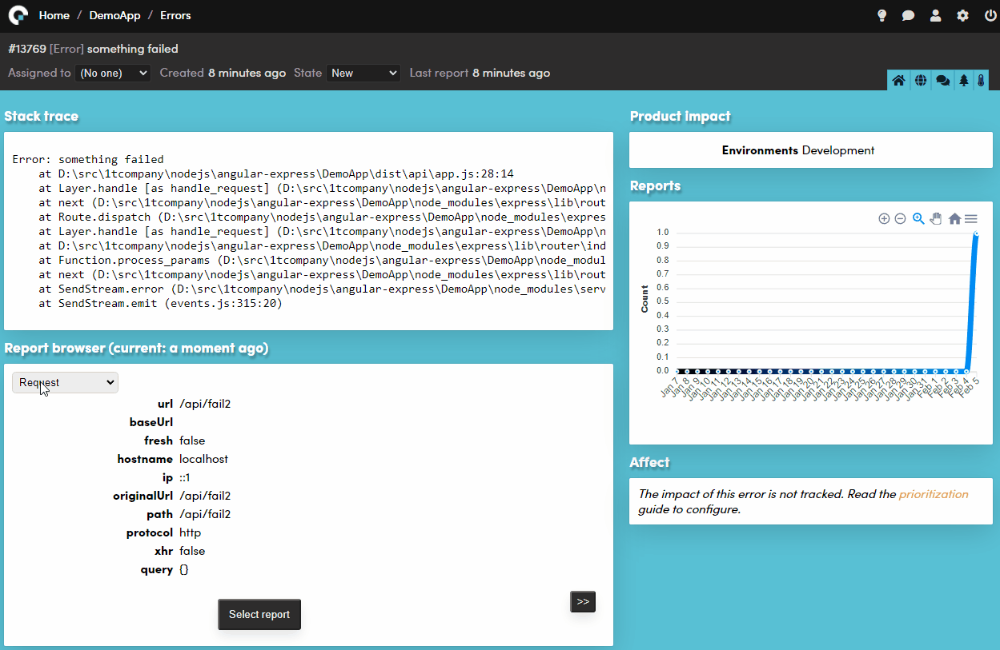

ExpressJS library for coderr.io
===============================

Coderr provides automated error reporting for ExpressJS-based applications.

_this is a beta library, feel free to try it_



https://coderr.io

## Installation

Download this package:

```js
npm -I coderr.client.expressjs
```

Import both the Coderr base library and the expressjs package:

```javascript
import { err } from "coderr.client";
import { activatePlugin, errorMiddleware } from "coderr.client.expressjs";

// in the top of your app.js/ts
err.configuration.credentials("https://reporting.coderr.io", "yourAppKey", "yourSharedSecret");

// To configure the expressJS plugin.
activatePlugin(err);

// As the last middleware:
app.use(errorMiddleware);

```

## Reporting slow queries.

You can report slow queries and/or all pages that generate 403 (Forbidden).

Add the coderrMiddleware for that:

```javascript
import * as coderr from "coderr.client.expressjs";

// Either use this to set a limit to all HTTP verbs (in milliseconds)
coderr.requestTimeThreshold = 200;

// or do it per verb:
coderr.requestMethodTimeThresholds['post'] = 200;

// As the *first* middleware:
app.use(coderr.coderrMiddleware);
```

## Reporting forbidden requests

You can report all requests that generates 403 forbidden:

```javascript
import * as coderr from "coderr.client.expressjs";

coderr.reportForbidden = true;

// As the *first* middleware:
app.use(coderr.coderrMiddleware);
```

## Further reading

Start with our getting started guide:

https://coderr.io/documentation/getting-started
